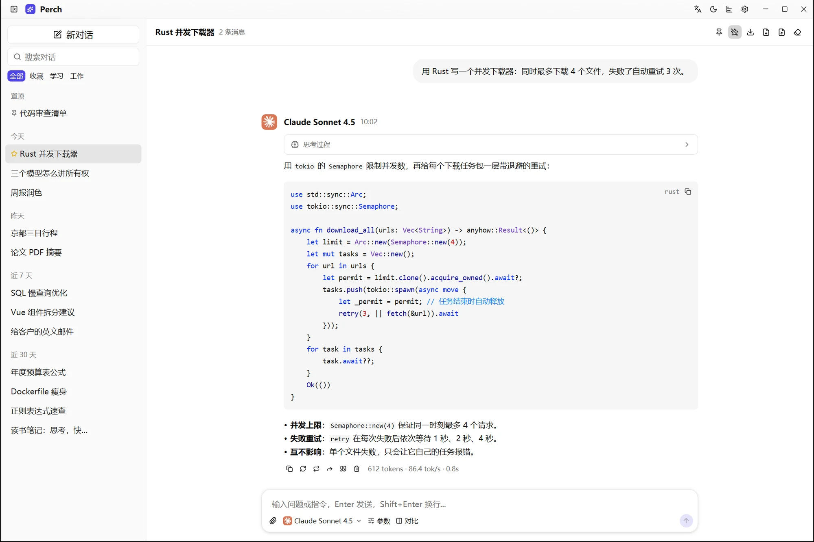
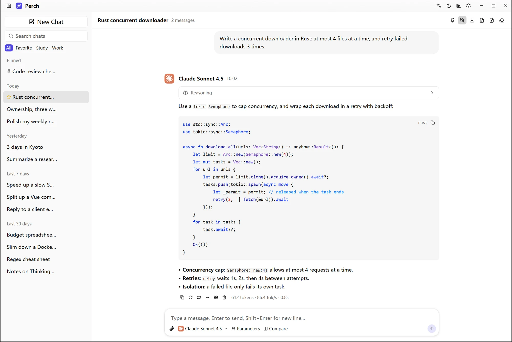
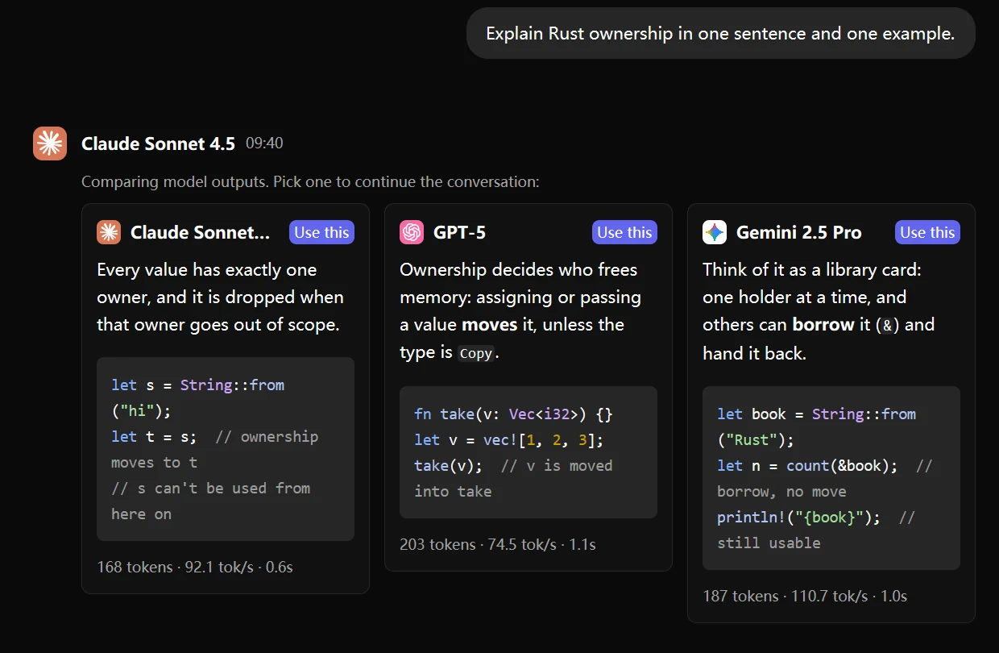
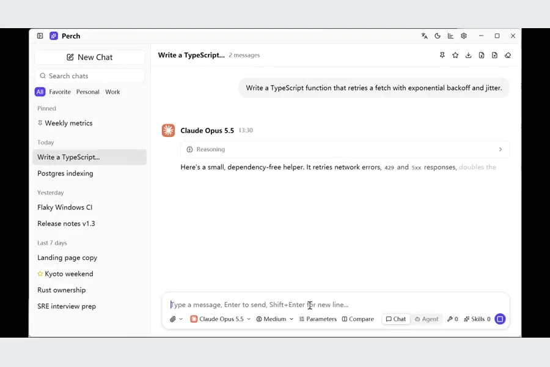

# Perch

Perch 是一款用 Rust + GPUI 构建的桌面 AI 对话客户端。自备 API Key（BYO-key），连接 Claude、OpenAI、Gemini 等模型服务，在一个窗口里管理会话与模型。

- 对话支持图片和文件附件，可按需启用 MCP 工具与 Skills。
- Agent 模式可在授权后操作本机文件、执行命令；可设置项目目录并查看操作审计记录。
- **安全提示：Agent 不是沙盒。** 授权本机工具前请确认项目目录和权限；完全权限下的操作可能影响项目目录之外的文件。

## 界面预览







## 演示视频

点击封面观看约 136 秒的语音讲解演示（MP4）：

[](docs/media/perch-tour.mp4)

## 安装与构建

v0.0.1 即将通过本仓库的 GitHub Releases 发布；目前可从源码构建。需要安装 Rust 工具链，在本仓库根目录执行：

```sh
cargo build --release
cargo run --release
```

目前已验证 Windows x64；其他平台正在通过 CI 验证，暂不保证可用。启动后需自行配置所用模型服务的 API Key。

## 在线更新

在「设置 → 关于」开启在线更新后，点击「检查更新」才会访问公开的 GitHub Releases；不会在启动时自动联网检查。发现新版本后可下载当前系统/架构的发布包，Perch 会核对文件大小和 SHA-256，并在安装前再次请你确认。

Windows 安装版会启动用户级安装器并退出 Perch；Linux 只有从可写的 AppImage 启动时才会自动替换并重启，其他安装方式转为手动；macOS 首版没有签名/公证，下载后由你手动安装并处理系统安全提示。当前临时方案依赖 GitHub HTTPS 和清单中的 SHA-256，**没有独立发布签名**；不要安装来源不明的包。首个 `v0.0.1` 发布前，「检查更新」会提示尚无发布版本。

Actions 在六个原生桌面 runner 上构建测试，任何一端失败都不会发布完整 Release。更多发布脚本在 `tools/release/`。
